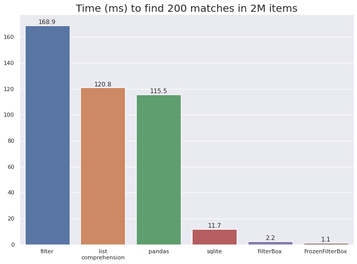

[](https://github.com/manimino/dbox/actions)
[](test/cov.txt)
[](/LICENSE)


# DBox

Container that stores objects in tree indexes for fast lookup.

Install: `pip install dbox`

Usage:
```
from dbox import DBox
d = DBox(objects, ['x', 'y'])  # create DBox containing objects, indexed on x and y
d[{
    'x': {'>': 5, '<': 10},     # find objects where x is between 5 and 10
    'y': {'in': [1, 2, 3]}      # and y is 1, 2, or 3
}]
```

Valid operators are ==, !=, <, <=, >, >=, in, not in. 

#### Is DBox a database?

No. But like a database, DBox builds B-tree indexes and uses them to find results very quickly. It does
not any do other database things like SQL, tables, etc. This keeps DBox simple, light, and performant.

#### Is DBox fast?

Yes. Here's how DBox compares to other object-finders on an example task.



The closest thing to a DBox is an in-memory SQLite. While SQLite is a fantastic database, it requires much
more overhead. As such, DBox is generally faster.

### Example

Find a good day for flying a kite. It needs to have sunny skies and a wind speed between 5 and 10.

```
from dbox import DBox

days = [
    {'day': 'Saturday', 'sky': 'sunny', 'wind_speed': 1},
    {'day': 'Sunday', 'sky': 'rainy', 'wind_speed': 3},
    {'day': 'Monday', 'sky': 'sunny', 'wind_speed': 7},
    {'day': 'Tuesday', 'sky': 'rainy', 'wind_speed': 9},
    {'day': 'Wednesday', 'sky': 'sunny', 'wind_speed': 25}
]

d = DBox(                     # make a DBox
    days,                     # add objects of any Python type
    on=['sky', 'wind_speed']  # what to index on
)

dbox[{
    'sky': 'sunny', 
    'wind_speed': {'>': 5, '<': 10}
}]
# result: [{'day': 'Monday', 'sky': 'sunny', 'wind_speed': 7}]
```

`{'sky': 'sunny'}` is a shorthand for `{'sky': {'==': sunny}}`.

### Class APIs

There are three containers.
 - [DBox](https://dbox.readthedocs.io/en/latest/dbox.mutable.html#dbox.mutable.main.DBox): 
Can add / remove items after creation.
 - [ConcurrentDBox](https://dbox.readthedocs.io/en/latest/dbox.concurrent.html#dbox.concurrent.main.ConcurrentDBox): 
Same as DBox, but thread-safe.
 - [FrozenDBox](https://dbox.readthedocs.io/en/latest/dbox.frozen.html#dbox.frozen.main.FrozenDBox):
Cannot add / remove items after creation, it's read-only. But it's super fast, and of course thread-safe.

All three can be pickled using the special functions `dbox.save()` / `dbox.load()`. 

### Part 2

[Readme Part 2](/README_part_2.md) has lots more examples, including handling of nested data and missing attributes.
